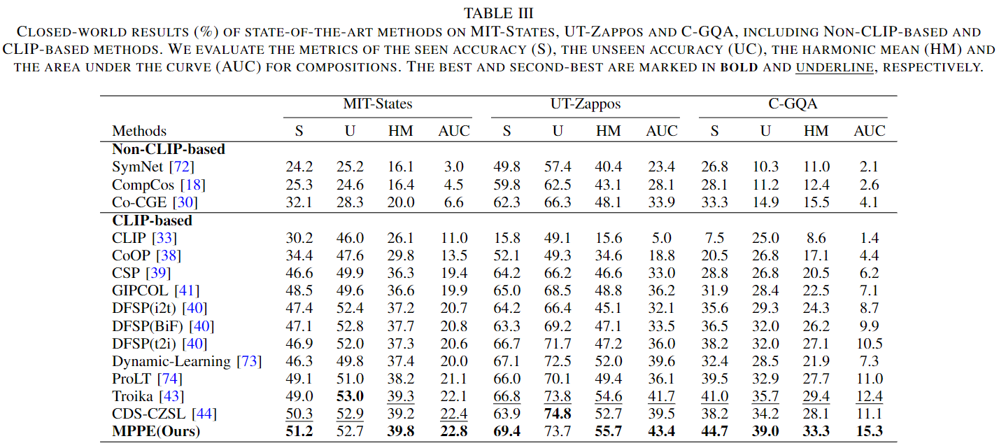
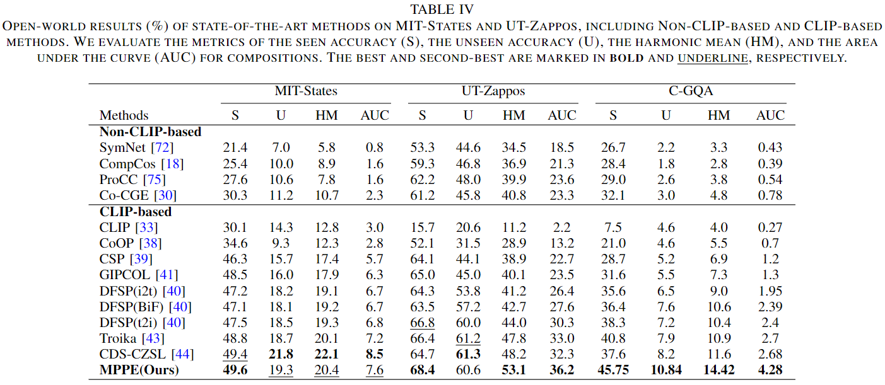
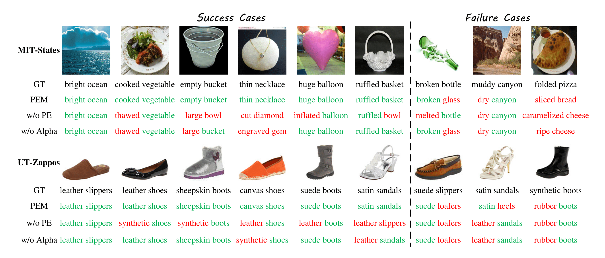
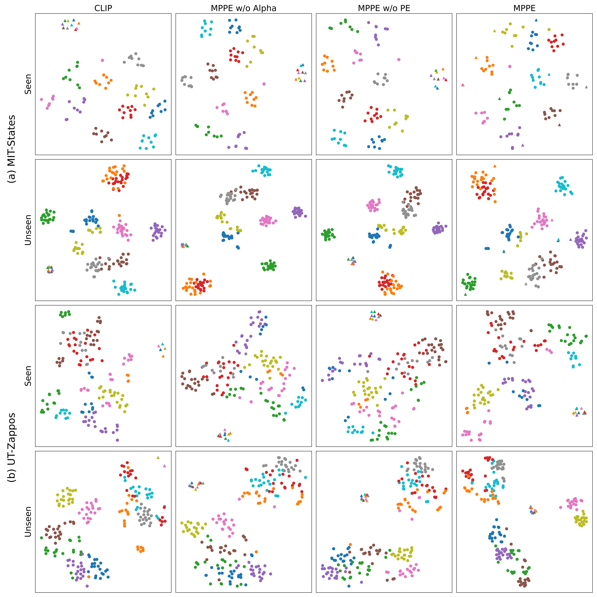

# MPPE
- **Title: Multi-modal Prompts with Primitives Enhancement for Compositional Zero-Shot Learning （MPPE）**
- **Authors: Yutang Jin, Shiming Chen, Tianle Tong, Weiping Ding, Yisong Wang.**
- **Institutes: Guizhou University, Huazhong University of Science and Technology, Nantong University.**

This paper is currently under review at TCSVT. Once accepted, we will release the model code and weights, and further improve this open-source project.

## Overview
<p align="center">
  
</p>

The overview of the proposed MPPE model. MPPE is based on CLIP, with two primitive prompts and one compositional prompt, which are totally learnable. Additionally, a visual prompt named Alpha branch is introduced to help focus on regions of interest, by binary masks from SAM model with corresponding object label, especially, $\color{red}\dagger$</font> denotes the label is only used in the training phase. Another main part of our work is the primitives enhancement module(termed as PE), primitive semantic features from text encoder are fed into PE to generate enhanced compositional semantic features, as an extra compositional prediction branch. Specifically, the primitives enhancement module is based on cross-attention, object and attribute semantic features $t^{o}$ and $t^{a}$ are fed into and as query and key, value respectively, followed with nonlinear transformations, finally the enhanced compositional semantic features $\hat{T_{c}}$ is generated. Additionally, a learnable coefficient $\lambda$ is included for controlling the weight of enhanced compositional semantic features.

## Results
### Main Results
The results in CW-CZSL and OW-CZSL settings. More implementation details are illustrated in the paper.
<p align="center">
  
</p>
<p align="center">
  
</p>

### Qualitative Results
<p align="center">
  
</p>

Qualitative results of different architecture of our method. We evaluate top-1 predictions for some cases on the MIT-States and UT-Zappos. GT means ground truth labels, PE is the primitives enhancement module and Alpha denotes the visual prompt branch of our MPPE. $\color{green}Green$ and $\color{red}red$ denotes successful and unsuccessful predictions, respectively.

### t-SNE visualization on Two Benchmarks
<p align="center">
  
</p>

t-SNE visualization on (a) MIT-States and (b) UT-Zappos, including seen and unseen compositions. For this analysis, we selected four models: CLIP, MPPE without the Alpha branch (MPPE w/o Alpha), MPPE without the primitives enhancement module (MPPE w/o PE), and the full MPPE model. On the test sets of MIT-States and UT-Zappos, we randomly selected ten seen compositions and ten unseen compositions for visualization. In this figure, circular dots represent the visual features of image samples, while triangular markers denote text features of corresponding labels. Samples of the same composition class are indicated by identical colors.

## Usage
### Setup 
1. Clone the repo 
2. We recommend using Anaconda for environment setup. To create the environment and activate it, please run:
```
    conda env create --file environment.yml
    conda activate czsl
```
3. Go to the cloned repo (download_data) and open a terminal. Download the datasets:
```
    sh download_data.sh
```
4. Download SAM model from [segment-anything](https://github.com/facebookresearch/segment-anything), and run:
```
    python generate_mask_code/seg_czsl.py
```
to get binary masks.

### Training
To train MPPE, the command is:
```
    python train.py --yml_path config/mppe/mit-states.yml --dataset_path datasets/mit-states --clip_arch pretrained_clip/ViT-L-14.pt --alpha_vision_ckpt_pth pretrained_alphaclip/clip_l14_grit20m_fultune_2xe.pth --save_path logs
```

## Acknowledgement
This project mostly references [[Troika]](https://github.com/bighuang624/Troika) and [[DFSP]](https://github.com/Forest-art/DFSP), and I once again express my sincere gratitude to the authors of these two papers!

