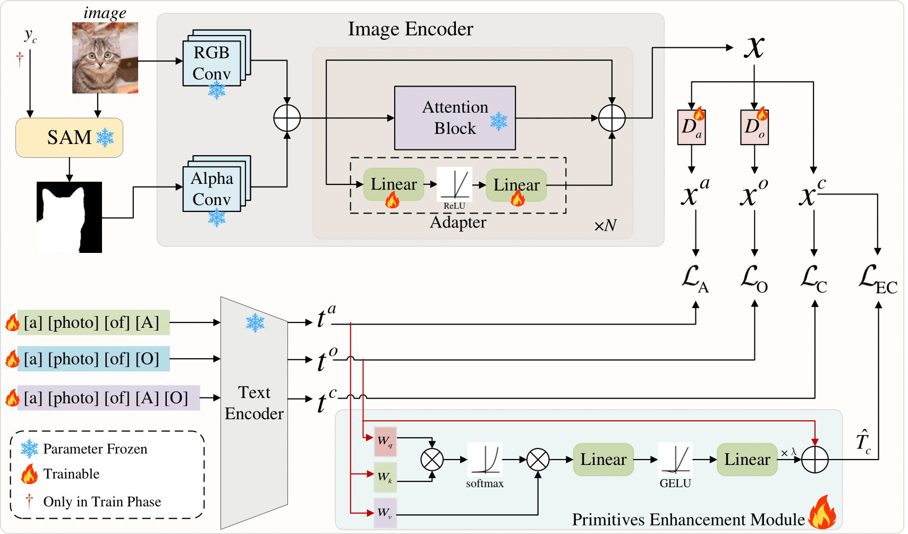

# MPPE
- **Title: Multi-modal Prompts with Primitives Enhancement for Compositional Zero-Shot Learning （MPPE）**
- **Authors: Yutang Jin, Shiming Chen, Tianle Tong, Weiping Ding, Yisong Wang.**
- **Institutes: Guizhou University, Huazhong University of Science and Technology, Nantong University.**

This paper is currently under review at TCSVT. Once accepted, we will release the model code and weights, and further improve this open-source project.

## Overview

  

## Acknowledgement
This project mostly references [[Troika]](https://github.com/bighuang624/Troika) and [[DFSP]](https://github.com/Forest-art/DFSP), and I once again express my sincere gratitude to the authors of these two papers!
